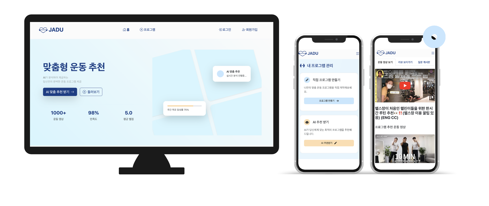
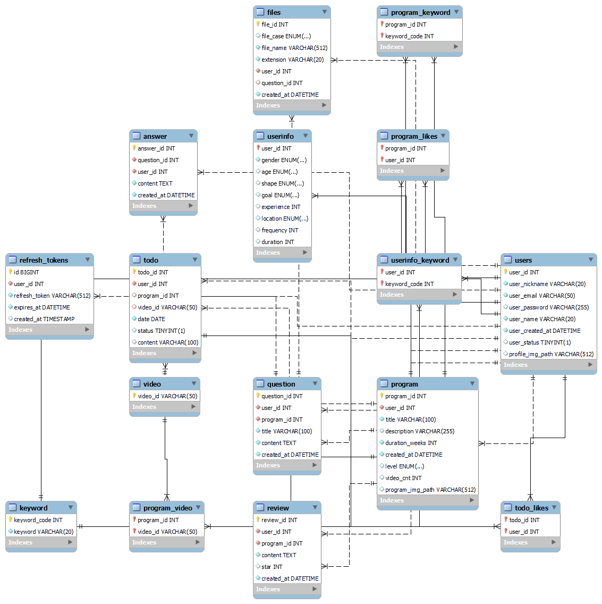

# 💡프로젝트 소개

- 프로젝트 명 : 자두 (JADU)
- 프로젝트 기간 : 2024년 11월 10일 ~ 2024년 11월 27일 (2주)
- 프로젝트 소개 : AI 기반 맞춤형 운동 프로그램과 투두 리스트 관리, 커뮤니티 기능으로 사용자에게 체계적이고 동기부여되는 운동 경험을 제공합니다.

- 배포 링크 : http://jadu.today

    

# PROJECT 팀원

|                                                    김민성                                                     |                                                              김현진                                                              |
| :-----------------------------------------------------------------------------------------------------------: | :------------------------------------------------------------------------------------------------------------------------------: |
| 

 | 

 |
|                                [@MINSSUNGKIM](https://github.com/MINSSUNGKIM)                                 |                                             [@hyun0zin](https://github.com/hyun0zin)                                             |

  

# 💻 TECH STACKS

<h3>Environment</h3> 

  

<h3>BACKEND</h3> 

 

<h3>FRONTEND</h3> 

   

<h3>DATABASE</h3> 

 

<h3>Deployment</h3> 

  

  

# 🎯 주요 기능

## 1. **사용자 맞춤형 운동 프로그램 생성**

- 생성형 AI를 활용한 사용자 정보 기반 맞춤형 운동 프로그램 추천
- YouTube API를 활용한 운동 영상 검색 및 선택
- 프로그램 기간 및 난이도 설정

## 2. **커뮤니티 시스템**

- 프로그램별 리뷰 작성
- Q&A 게시판
- 댓글 시스템
- 좋아요 기능

## 3. **Todo List 관리**

- 프로그램 기반 자동 Todo List 생성
- 운동 완료 체크 기능
- 캘린더 뷰 제공

## 4. **다양한 로그인 기능**

- KAKAO, GOOGLE AUTH 로그인 기능 구현
- JWT 토큰 기반 이메일 로그인 기능 구현

## 5. 외부 API 사용

- YouTube Data API v3
- ChatGPT API

  

  

# 기술적 의사 결정

## AI PROMPT 기술 도입 배경

- 유저 운동 정보를 받아 맞춤형 프로그램을 제작 시, 임의로 프로그램 생성하는데 어려움을 겪음.

 

> AI PROMPT 작성을 통해, 생성형 AI로부터 맞춤형 프로그램 정보 응답 받기
>
> 

 

- 페르소나 설정 및 응답 규칙과 응답 형태를 JSON 형태로 반환하도록 규칙 설정
- 이후, JSON 파싱하여 DTO로 응답 데이터 관리

  

# ERD Diagram

  

# 프로젝트 후기

| 이름   | 내용                                                                                                                                                                                                                                                                                                                                                                                                                                                                                                                                                                            |
| ------ | ------------------------------------------------------------------------------------------------------------------------------------------------------------------------------------------------------------------------------------------------------------------------------------------------------------------------------------------------------------------------------------------------------------------------------------------------------------------------------------------------------------------------------------------------------------------------------- |
| 김민성 | 이번 프로젝트를 계기로 기획부터 배포까지 모든 작업을 되짚어가며, 여러 기술들과 개념들을 복습할 수 있었고, 앞으로의 다양한 프로젝트 개발 과정에서도 큰 흐름을 알고, 협업 과정이 원활하게 이뤄질 수 있을 것 같습니다. 또한 프로젝트에서 기존의 기술에 한계점을 느낄 때, 필요한 기술들을 새로 찾아보고 적용하는 방법도 익힐 수 있었고, 앞으로 다양한 기술을 적용함에 있어 겁먹지 않고 추진할 용기를 얻을 수 있었습니다. 이번 프로젝트에서 얻은 것들을 잘 정리하여 추후에 다른 프로젝트를 진행하는 데 큰 추진력을 얻고, 나아가 한 명의 개발자로 자리 잡을 동력을 얻었다 생각합니다. |
| 김현진 | 프로젝트를 통해 프론트엔드, 백엔드, 데이터베이스 등 웹 개발에 필요한 전반적인 기술을 접목하여 실무 감각을 익힐 수 있었고, 실제 서비스를 개발할 수 있는 좋은 기회였습니다. 프로젝트를 진행하면서 발생한 다양한 문제를 해결하면서 한층 더 성장할 수 있었다고 생각합니다. 또한 팀원과 함께 서로 아이디어를 공유하고 문제를 해결하는 과정을 통해 협업과 기획의 중요성에 대해서 다시 느낄 수 있었습니다.                                                                                                                                                                             |
